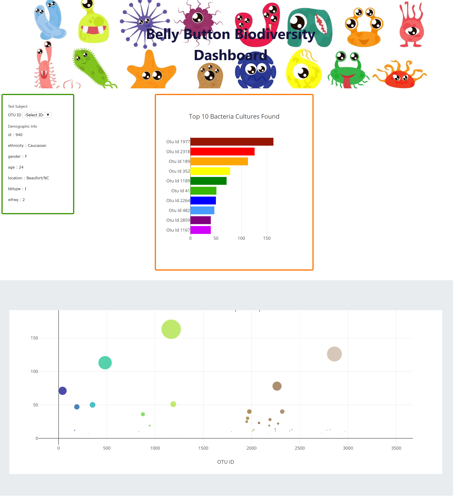

# Plotly

__Study Javascript and Plotly__

- **Use Javascript**
 - *map()* method creates a new array with the results of calling a function for every array element.
 - *forEach()* method calls a function once for each element in an array, in order.
 - *filter()* method creates an array filled with all array elements that meet a condition provided in the function.
 - *Object.entries()* method returns an array of a given object's own enumerable string-keyed property [key, value] pairs.
 - *slice()* method returns the specific selected elements in an array, as a new array object. This method selected the elements starting at the given start argument, and ends at, *but does not include*, the given end argument.
 - *toString()* method converts number to string and adds prefix infront of number.
 
- **Use Plotly** to create bar chart and bubble charts

# Project Name

**Belly Button Biodiversity**

# Challenges
- Extracted data from JSON file : nested objects has to be referred correctly.
- Upload index.html by using init() fuction to shows the default value before user select from drop down list.

# Website 

## Sources :-
- Background image from [vectorstock](https://www.vectorstock.com/).
- Study context from 
  - [w3schools](https://www.w3schools.com).
  - [mozilla.org](https://developer.mozilla.org/).
